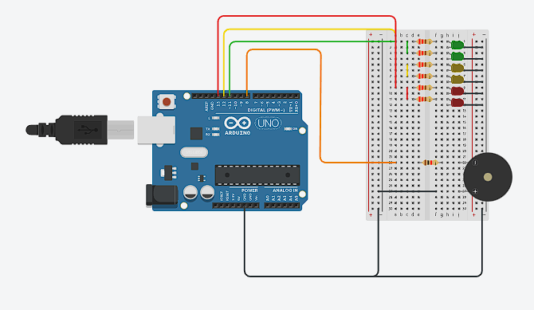

# Ejercicio Dojo 1

##Alumno: Benjamin Andres Aguilera

## Integrantes 
- Benjamin Andres Aguilera
- Pablo Nicolas Aguilar
- Thiago Fernandez Lado
- Josue Damacio

## Proyecto: Semaforo

## Descripción
La funcion de este trabajo es crear un semaforo que sea utilizable por gente vidente y no vidente.

## Función principal
~~~
#define buzzer 8
#define LED_ROJO 13
#define LED_AMARILLO 12
#define LED_VERDE 11
int contador = 0;
void setup()
{
  pinMode(buzzer, OUTPUT);
  pinMode(LED_ROJO, OUTPUT);
  pinMode(LED_AMARILLO, OUTPUT);
  pinMode(LED_VERDE, OUTPUT);
}
~~~

Definimos los LEDs de colores que vamos a utilizar y el buzzer para los no videntes. Despues hacemos el void setup para que la señal salga de los pins definidos.
~~~
void loop() {
  prendeLed(LED_VERDE,30000);
  delay(15000);
  apagaLed(LED_VERDE,0);
  prendeLed(LED_AMARILLO,0);
  noVidentes(5000,100,500,2000);
  apagaLed(LED_AMARILLO,1000);
  prendeLed(LED_ROJO,0);
  noVidentes(30000,500,500,500);
  apagaLed(LED_ROJO,1000);
}
~~~
Esta funcion funciona para crear la funcion del semaforo, loopeando infinitamente. La luz verde dura 45 segundos, la luz amarilla dura 15, y la luz roja dura 30 segundos, todos estos tiempos introducidos por parametro. Para los no videntes definimos el tono y la duracion del buzzer, que suena 1 vez cada dos segundos cuando el semaforo esta en amarillo con un tono suave, y 1 vez por segundo en un tono fuerte. Estos son introducidos por parametro tambien.
~~~
void noVidentes(int tiempo, int potencia, int suena, int espera) {
  while (contador != (tiempo / (suena+espera))) {
    tone(buzzer, potencia, suena);
    delay(espera);
    contador++;
  }
  contador = 0;
}
~~~
Para los no videntes utilizamos la funcion noVidentes en la cual introducimos por parametro el tono, la duracion del buzzer cada cuanto suena y el timpo total durante el cual el semaforo se encuentra en cada color.
~~~
void prendeLed(int led, int  tiempo){
    digitalWrite(led, HIGH);//encender LED
      delay(tiempo); // esperar por tiempo
  }

void apagaLed(int led,int tiempo){
      digitalWrite(led, LOW);//endender LED
    delay(tiempo); // esperar por tiempo
}
~~~
Con estas dos funciones le indicamos por parametros a los LED cuanto tiempo deben estar prendidos y apagados. Es utilizada en el codigo principal para cumplir el funcionamiento del semaforo.

## Link al proyecto :eggplant:
- [proyecto](https://www.tinkercad.com/things/hBh0UVomjyM-prueba-tpgrupal/editel?sharecode=E750hfyh9kLGIuqLQaVF5h5EdYSLmSpoakgl8z9V1h4)

